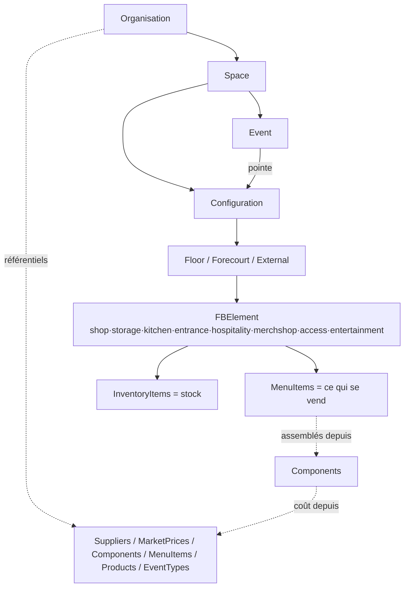
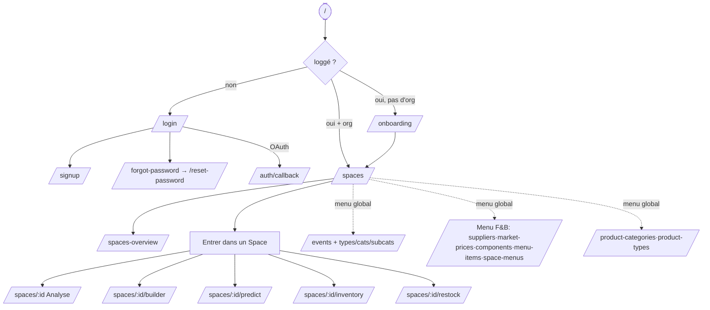
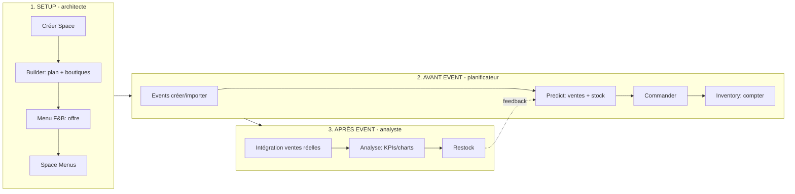
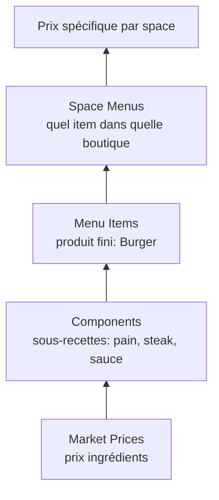
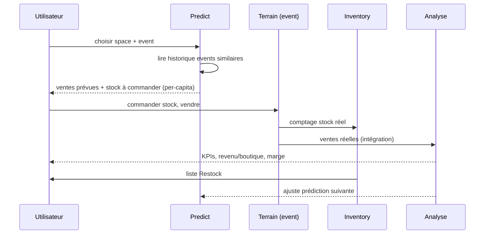

# DataFriday — Guide des parcours utilisateur

> But du doc : comprendre **toute** l'app via ses parcours. Basé sur le router Vue (prod) + maquette React (`versionReact/`).
> Domaine : SaaS de gestion **F&B (restauration)** dans les grands lieux (stades, arénas, salles d'événements).
> Question résolue : *"Combien vais-je vendre, combien commander, combien de staff, et combien ai-je gagné ?"*

---

## Schémas visuels (mermaid)

> PNG exportés : [`docs/diagrams/`](docs/diagrams/) · sources `.mmd` à côté · régénérer : voir bas de section.

| # | Schéma | PNG |
|---|---|---|
| A | Modèle de données | [A-data-model.png](docs/diagrams/A-data-model.png) |
| B | Flux navigation | [B-navigation.png](docs/diagrams/B-navigation.png) |
| C | Boucle métier 3 phases | [C-business-loop.png](docs/diagrams/C-business-loop.png) |
| D | Pyramide offre F&B | [D-menu-pyramid.png](docs/diagrams/D-menu-pyramid.png) |
| E | Séquence predict→mesure | [E-sequence.png](docs/diagrams/E-sequence.png) |

Régénérer les PNG :
```bash
cd docs/diagrams
for f in A-data-model B-navigation C-business-loop D-menu-pyramid E-sequence; do
  npx -y @mermaid-js/mermaid-cli -i "$f.mmd" -o "$f.png" -b white -s 2
done
```

### A. Modèle de données (hiérarchie)



### B. Flux de navigation (routes + gardes)



### C. Boucle métier (les 3 phases)



### D. Pyramide de l'offre F&B (Menu)



### E. Séquence : prévoir → vendre → mesurer



---

## 0. Carte mentale (du plus gros au plus petit)

```
Organisation (client / traiteur de stade)
 └─ Space (le lieu : "Stade Auxerre")
     ├─ Configuration (agencement par type d'event : "Match", "Concert")
     │   └─ Floor / Forecourt / External (étages + zones)
     │       └─ FBElement (point de vente : shop, storage, kitchen, entrance, hospitality, merchshop, access, entertainment)
     │           ├─ MenuItems   (ce qui se vend)
     │           └─ InventoryItems (le stock)
     └─ Events (matchs/concerts datés, liés à une configuration)

Référentiels transverses (par organisation) :
  Suppliers · Market Prices · Components · Menu Items · Product Categories/Types
  Event Types / Categories / Subcategories
```

**Boucle de valeur** :
```
Prédire (Predict) → Commander stock → Vendre pendant event
   → Compter (Inventory) → Réarmer (Restock) → Mesurer (Analyse) → améliore la prédiction suivante
```

---

## 1. Carte des routes (Vue — `src/router/index.js`)

| Zone | Route | Nom | Garde | Écran |
|---|---|---|---|---|
| **Auth** | `/login` | login | guestOnly | Connexion |
| | `/signup` | signup | guestOnly | Créer compte |
| | `/forgot-password` | forgot-password | guestOnly | Mot de passe oublié |
| | `/reset-password` | reset-password | — | Réinit. mot de passe |
| | `/verify-email` | verify-email | — | Vérif. email |
| | `/auth/callback` | auth-callback | — | Retour OAuth |
| **Onboarding** | `/onboarding` | onboarding | requireAuth | Créer organisation |
| **Spaces** | `/spaces` | spaces | requireOrganization | Liste des spaces |
| | `/spaces-overview` | spaces-overview | requireOrganization | Vue d'ensemble |
| | `/spaces/:spaceId` | space-analyse | requireOrganization | **Analyse** d'un space |
| | `/spaces/:spaceId/builder` | SpaceBuilder | requireOrganization | **Builder** plan 3D |
| | `/spaces/:spaceId/predict` | space-predict | requireOrganization | **Event Predict** |
| | `/spaces/:spaceId/inventory` | space-inventory | requireOrganization | Inventaire du space |
| | `/spaces/:spaceId/restock` | space-restock | requireOrganization | Réarmement |
| **Events** | `/events` | events | requireOrganization | Liste événements |
| | `/event-types` | event-types | requireOrganization | Types |
| | `/event-categories` | event-categories | requireOrganization | Catégories |
| | `/event-subcategories` | event-subcategories | requireOrganization | Sous-catégories |
| **Menu F&B** | `/suppliers` | suppliers | requireOrganization | Fournisseurs |
| | `/market-prices` | market-prices | requireOrganization | Prix du marché |
| | `/components` | components | requireOrganization | Composants |
| | `/components/new` `/components/edit/:id` | component-create / -edit | requireOrganization | Créer/éditer composant |
| | `/space-menus` | space-menus | requireOrganization | Menus par space |
| | `/space-menus/:spaceId/shops/:shopId` | shop-detail | requireOrganization | Détail boutique |
| | `/menu-items` | menu-items | requireOrganization | Menu items |
| | `/menu-items/create` `/menu-items/edit/:id` | menu-item-create / -edit | requireOrganization | Créer/éditer menu item |
| **Produits** | `/product-categories` | product-categories | requireOrganization | Catégories produits |
| | `/product-types` | product-types | requireOrganization | Types produits |
| **Divers** | `/predict-test` | predict-test | aucune (mock) | Banc de test moteur predict |
| | `/about` | about | — | À propos (legacy) |
| | `/` → `/dashboard` → `/spaces` | redirects | — | |
| | `/:pathMatch(.*)*` → `/dashboard` | 404 | — | |

**Gardes** (`src/router/guards.js`) :
- `guestOnly` → si déjà loggé → `/dashboard` (ou `/onboarding` si pas d'org)
- `requireAuth` → pas loggé → `/login?redirect=...`
- `requireOrganization` → pas loggé → `/login` ; loggé sans org → `/onboarding`. **Bypass démo : `?demo=1`**
- `requireAdmin` / `requireManager` → définis mais non câblés sur les routes actuelles (rôles futurs)

---

## 2. Parcours d'authentification

### 2.1 Inscription
```
/signup → saisie email + mot de passe → email de vérification envoyé
   → /verify-email → clic lien → /auth/callback → /onboarding
```

### 2.2 Connexion
```
/login → email + mot de passe (ou OAuth)
   ├─ loggé + a une org   → /dashboard (= /spaces)
   ├─ loggé + pas d'org   → /onboarding
   └─ OAuth               → /auth/callback → routage selon org
```

### 2.3 Mot de passe oublié
```
/login → "mot de passe oublié" → /forgot-password → email
   → lien → /reset-password → nouveau mdp → /login
```

### 2.4 Déconnexion
`UserMenu` → logout → token effacé → `/login`.

### 2.5 Mode démo (dev/local)
`?demo=1` court-circuite `requireOrganization` → accès direct predict/analyse sans login.
Banc isolé : `/predict-test` (données JSON mockées, aucune auth).

---

## 3. Onboarding (1ère connexion)
```
/onboarding → créer organisation (nom, infos)
   → org rattachée au compte → /spaces
```
Sans org, toutes les routes protégées renvoient ici. State : `auth/hasOrganization`.

---

## 4. Parcours Spaces (cœur de navigation)

### 4.1 Liste & overview
```
/spaces            → liste des spaces (cartes + métriques cachées : revenu F&B/merch/billetterie)
/spaces-overview   → vue d'ensemble multi-spaces (comparaison globale)
```
Actions liste : créer space (`SpaceFormDialog`), éditer, upload image, sélectionner → entre dans le space.

### 4.2 Entrer dans un space → 5 outils
Depuis une carte space, accès aux 5 onglets (via `MainNav` / `BurgerMenu`) :

| Outil | Route | Rôle |
|---|---|---|
| Analyse | `/spaces/:id` | Bilan après-event |
| Builder | `/spaces/:id/builder` | Dessiner le plan |
| Predict | `/spaces/:id/predict` | Prévoir ventes/stock |
| Inventory | `/spaces/:id/inventory` | Compter le stock |
| Restock | `/spaces/:id/restock` | Réarmer |

---

## 5. Parcours Builder (`/spaces/:spaceId/builder`)
But : modéliser physiquement le lieu et ses points de vente.

Widgets : `FloorPlanBuilderView`, `ElevationBuilderView`, `ElementPaletteView`, `PropertiesPanelView`, `FloorListView`.

```
1. Choisir/créer une Configuration (agencement pour "Match" vs "Concert")
2. Gérer les niveaux (FloorList) : Floor / Forecourt / External — tailles, trous (hole), corner radius
3. Depuis la palette, glisser un FBElement sur le plan :
      shop · storage · kitchen · entrance · hospitality · merchshop · access · entertainment
4. Positionner : x/y, largeur/profondeur/hauteur, rotation, arrondis (PropertiesPanel)
5. Vue 2D (FloorPlan) ↔ Vue 3D élévation (ElevationView)
6. Lier l'élément à une Area, définir storageType / shopType / staffPositions
7. Sauvegarder la configuration
```
Notion clé : `FBElementRegistry` (propriétés partagées) + `FBElementPlacement` (position **par configuration**). Même boutique, agencée différemment selon l'event.

---

## 6. Parcours Menu F&B (référentiel de l'offre)
Construit ce qui se vend, du bas vers le haut.

### 6.1 Pyramide de construction
```
Market Prices (prix ingrédients/marché)
   → Components (sous-recettes : "pain", "steak", "sauce")
      → Menu Items (produit fini vendu : "Burger" = pain + steak + sauce)
         → Space Menus (quels menu items dans quelle boutique de quel space)
```

### 6.2 Sous-parcours
- **Suppliers** `/suppliers` : CRUD fournisseurs (`AddEditSupplierDialog`, `SuppliersList`).
- **Market Prices** `/market-prices` : table hiérarchique des prix ; **import wizard** (`MarketPriceImportWizard`, CSV → mapping) ; ajout manuel (`MarketPriceAddDialog`).
- **Products** `/product-categories`, `/product-types` : taxonomie produits (`TypeCategorySelector`).
- **Components** `/components` → `/components/new` | `/components/edit/:id` : assemble ingrédients + quantités → coût.
- **Menu Items** `/menu-items` → `/menu-items/create` | `/edit/:id` : assemble composants → prix de vente, **marge** (`MenuItemMarginReport`).
- **Space Menus** `/space-menus` → `/space-menus/:spaceId/shops/:shopId` : affecte menu items aux boutiques ; prix spécifiques par space (`SpaceSpecificPricing`, `SpacePricingDialog`).

---

## 7. Parcours Events (calendrier)

### 7.1 Référentiels
```
/event-types        → Types (Foot, Concert, ...)
/event-categories   → Catégories
/event-subcategories→ Sous-catégories
```
Hiérarchie : Type → Catégorie → Sous-catégorie.

### 7.2 Événements
```
/events → liste → créer/éditer un Event :
   space + configuration, date, nom, type/cat/sous-cat,
   sessions (ouverture portes / show time), billets vendus/scannés,
   1ʳᵉ partie, entracte, équipe visiteuse, sponsor...
```
**Import en masse** : `EventsImportWizard` (fichier → mapping colonnes → validation → création). `LowConfidenceEventsDialog` signale les lignes douteuses.

Lien fort : un Event pointe une **Configuration** précise → le Predict et l'Analyse savent quel agencement utiliser.

---

## 8. Parcours Predict (`/spaces/:spaceId/predict`)
But : **avant** l'event, prévoir ventes et stock à commander.

```
1. Choisir le space + l'event (ou type d'event) à prédire
2. Le moteur lit l'historique des ventes (events passés similaires)
3. EventPredictMenusSection  → ventes prévues par menu item / par boutique
4. EventPredictStockUpSection → stock à commander (stock-up) pour éviter rupture ET surstock
5. Ajuster les hypothèses (affluence, per-capita attendu) → recalcul
6. Versionner la prédiction (useEventPredictVersions) → comparer scénarios
```
Métrique pivot : **per-capita** (revenu ÷ spectateurs) → compare un match 20k à un concert 40k.
Banc de test moteur : `/predict-test` (données mockées).

---

## 9. Parcours Inventory (`/spaces/:spaceId/inventory`)
But : compter le stock réel sur le terrain.

```
1. Vue d'inventaire du space → filtres (boutique, type stock) : InventoryFilterDrawer
2. Cartes par point de vente : InventoryShopCard / InventoryStorageCard
3. Interface de comptage : InventoryCountingInterface (saisie quantités)
4. Agrégation : InventoryAggregateView (totaux par produit / zone)
5. Sauvegarde du comptage (useInventoryCounts, useInventoryApi)
```

---

## 10. Parcours Restock / Réarmement (`/spaces/:spaceId/restock`)
But : après comptage, recalculer ce qu'il faut réapprovisionner.
```
Stock compté (Inventory)  vs  prévision (Predict)  →  liste de réarmement par boutique/stock
```
Boucle : Predict → Inventory → Restock → re-vente.

---

## 11. Parcours Analyse (`/spaces/:spaceId`)
But : **après** l'event, mesurer la performance réelle.

```
Header : 8 KPIs cliquables → ouvrent un dialog graphe (GenericByEventChart)
4 cartes : Cost / Revenue / Margin / Transaction Rate → dialog détail
Graphes :
   - EventRevenueByShopChart   (revenu par boutique, drilldown au clic barre)
   - ShopDistributionPieChart  (répartition par boutique → filtre au clic)
   - MenuItemRevenueDistribution (par type/catégorie de menu item)
   - PerCap / AvgTransaction / TransformationRate / AttendeesByEvent / CostByEvent
   - EventTimelineChart        (courbe temporelle pendant l'event)
   - MenuItemsByShopTable      (table filtrable)
Filtres globaux (store analyse) :
   selectedEventIds · selectedShopIds · selectedShopTypes · selectedShopAreas
   selectedMenuItemIds · selectedMenuItemTypes · selectedMenuItemCategories
Modes : single-event vs multi-event (comparaison) ; monthly/quarterly/yearly drilldown
```
Mobile : `AnalyseMobileSheet` / FilterBottomSheet.

---

## 12. Parcours Compte & Paramètres
- `UserMenu` / `SettingsMenu` : préférences, compte, déconnexion.
- `ConsolidatedAccountView`, `ConsolidatedHRView`, `ConsolidatedEventsView` : vues consolidées (compta, RH/staff, events).
- `HRSuppliersView`, `StaffPositionsView` : staff par boutique (lié à `staffPositions` des FBElement → coût staff dans l'Analyse).
- `FBIntegrationView` / `LocationIntegrationWizard` : connexion d'une source de données de ventes externe à un space.

---

## 13. Récap : 3 personas, 3 boucles

**Architecte de lieu** (setup initial)
```
Onboarding → créer Space → Builder (plan + boutiques) → Menu F&B (offre) → Space Menus
```

**Planificateur d'event** (avant chaque event)
```
Events (créer/importer) → Predict (ventes + stock) → commander → Inventory (compter)
```

**Analyste** (après chaque event)
```
F&B Integration (ventes réelles) → Analyse (KPIs, charts) → Restock → ajuster Predict suivant
```

---

## 14. Différences React (maquette) vs Vue (prod) — rappel
- **React** (`versionReact/`) : export Figma Make, **un seul `App.tsx`** (3029 l.), navigation par booléens `showXView`, **pas d'auth ni router**, backend Supabase Edge Function + KV store. = source de vérité UI/UX.
- **Vue** (`src/`) : app prod réelle, **vue-router** + gardes, **auth + multi-org**, **Vuex**, backend REST `/api/v1` (axios), PWA, architecture modulaire par domaine.
- Mêmes écrans/composants 1:1 → port en cours (voir `PORTING_PROGRESS.md`, `PLAN_PORT_REACT_VUE_ANALYSE.md`).
```
React showSpacesPage/showAnalyseView/... (état)  ≈  Vue /spaces, /spaces/:id, ... (routes)
```
